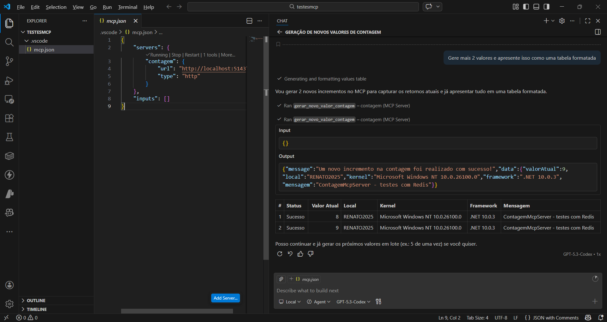
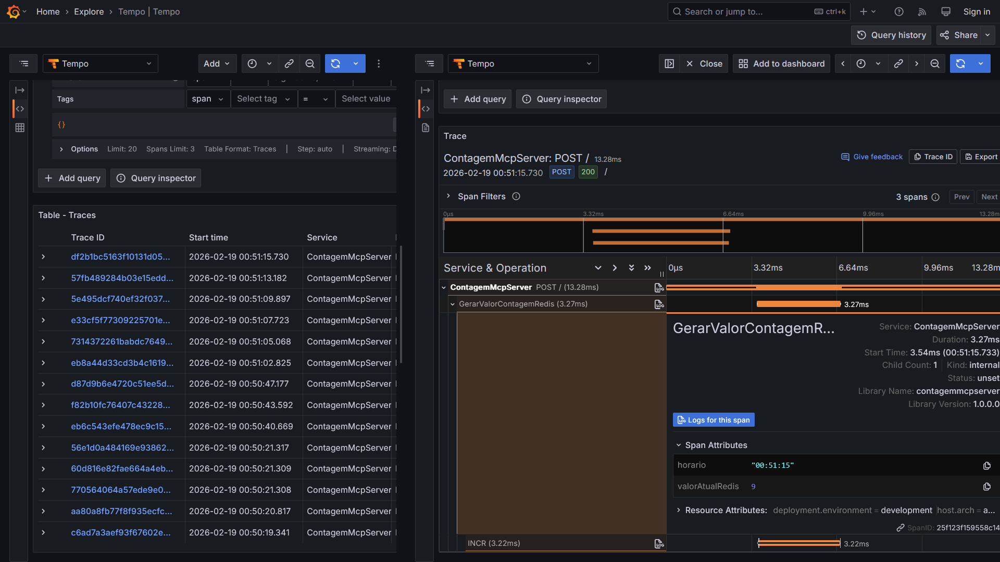

# aspnetcore10-mcp-otel-grafana-redis-testcontainers_contagem
Implementação em ASP.NET Core + .NET 10 de MCP Server para contagem de acessos a partir de uma instância do Redis gerada via Testcontainers. Inclui o uso de um script do Docker Compose para ambiente de monitoramento/observabilidade com OpenTelemetry + Grafana.

## Testes com o Visual Studio Code

Exemplo de arquivo **mcp.json**:

```json
{
	"servers": {
		"contagem": {
			"url": "http://localhost:5143",
			"type": "http"
		}
	},
	"inputs": []
}
```

Testes via chat do GitHub Copilot:



## Observabilidade

Traces exportados para o Grafana Tempo:

